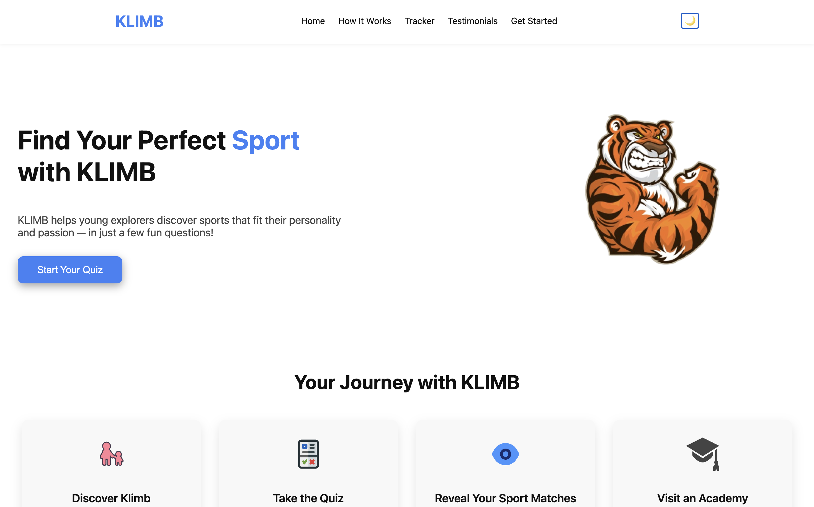
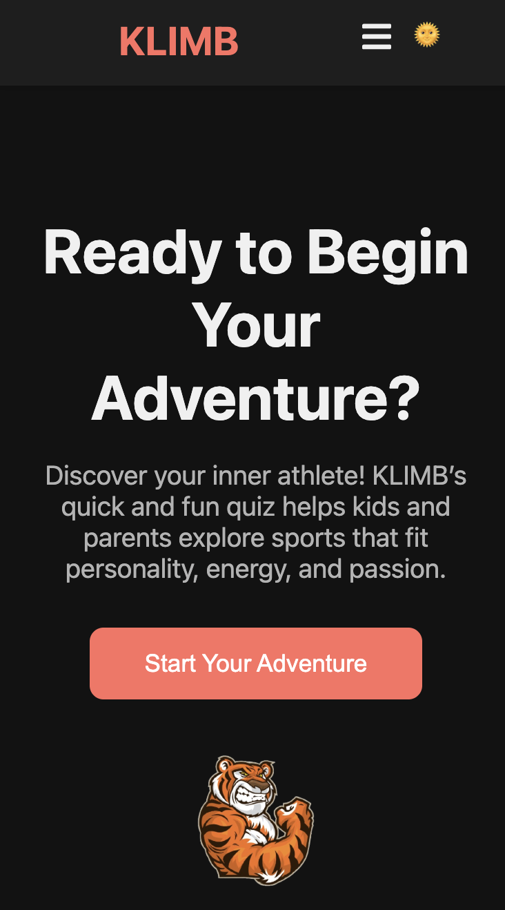
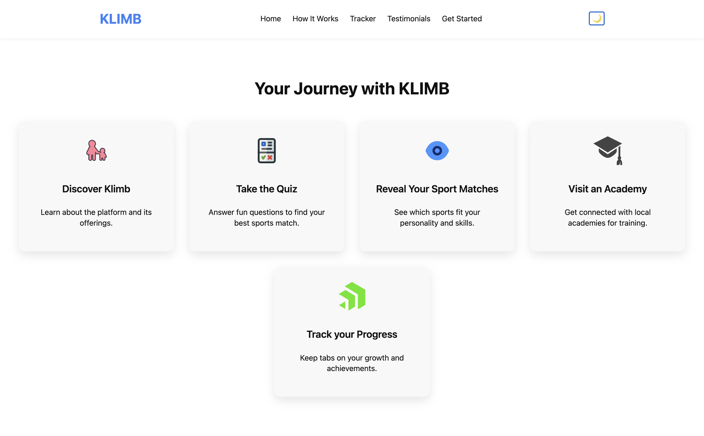

# KLIMB - Landing Page Application 🚀

A vibrant, responsive, and animated landing page built using **React**, **CSS**, and **Framer Motion**, designed specifically for the KLIMB platform—a child-friendly application that helps young users discover their ideal sport.

---

## 🌟 Features

- 🧭 **Sticky & Animated Navigation Bar**
- 🎯 **Hero Section** with playful visuals and animated CTA
- 🛤️ **Journey Tracker** with scroll-triggered animations
- 🧠 **Quiz Launcher** with mascot visuals and dark mode support
- 👨‍👩‍👧‍👦 **Testimonials Carousel** with animated cards and avatars
- 📦 **Fully Responsive** across all devices
- 🌙 **Dark Mode** support for all components

---

## 🧩 Tech Stack

- **React.js**
- **CSS** (no Tailwind used)
- **Framer Motion** (for scroll and fade animations)

---

## 📂 Folder Structure

```
/src
 ├── assets/
 │    └── icons/               # SVG icons
 ├── components/
 │    ├── Navbar.jsx
 │    ├── Hero.jsx
 │    ├── JourneyTracker.jsx
 │    ├── QuizLauncher.jsx
 │    ├── Testimonials.jsx
 │    └── Footer.jsx
 ├── styles/
 │    ├── Navbar.css
 │    ├── Hero.css
 │    ├── JourneyTracker.css
 │    ├── QuizLauncher.css
 │    ├── Testimonials.css
 │    └── Footer.css
 └── App.jsx
```

---

## 🛠️ Installation

```bash
npm install
npm run dev
```

---

## 📸 Screenshots

### 💻 Desktop View


### 📱 Mobile View


### 🧭 Journey Tracker


---

## 📬 Contact

Email: heisnikxy@gmail.com

---

